<h1 align='center'>
</img>
</h1>

<h1 style="color:green" >Julia Programming Intermediate</h1>

<h3>
 <a href="https://docs.julialang.org/en/v1/" >Julia Documentation</a>
</h3>

<h3 style="color:red"> Version : 1.6.1 </h3> 

<h3 style="color:gray">Created By Manthan Bhikadiya</h3>

### Reference Video Tutorial by Abhishek Agrawal :
* https://www.youtube.com/watch?v=lwj-1mclq0U

<h3 style="color:#e84545">Topics :</h3>

* Functions
* Formatting Number and Strings in Julia
* Working With CSV Files
* Data Visualization
* Working with Database
* Calling Python Packages
* Machine learning Project In Julia

<h2 style="color:#46b5d1">Functions</h2>


```julia
f() = println("Running the function") # single liner function , without argument
```


    f (generic function with 1 method)


```julia
f()
```

    Running the function
    


```julia
f(x) = x + x  # single argument function
```


    f (generic function with 2 methods)


```julia
println( f(2) )
println( f(2.4) )
```

    4
    4.8
    


```julia
f(x,y) = x*3 - y*2
```


    f (generic function with 3 methods)


```julia
f(3,2) # x=3,y=2 => 3*3 - 2*2 => 9-4 => 5
```


    5


```julia
# standard Function

function multiply(x,y)
    return (x*y) + (x+y)
end
```


    multiply (generic function with 1 method)


```julia
multiply(2,3) # x=2,y=3 => (2*3) + (2+3) => 6 + 5 => 11
```


    11


```julia
# simple function to check wheather a number is prime or not
# return true if number is prime otherwise false.

function is_prime(number)
    if number == 1
        return "Non-Prime (special case)"
    else
        for i in 2:number-1
            if number%i == 0
                return "Non-Prime"
            end
        end
    end
    return "Prime"
end
```


    is_prime (generic function with 1 method)


```julia
is_prime(7)
```


    "Prime"


<b style="color:#f7a440">FOR MORE CHECKOUT OFFICIAL DOCUMENTATION :</b><br>
<a href="https://docs.julialang.org/en/v1/base/base/#function"><b>Function</b></a>

<h2 style="color:#f55c47">Formatting Numbers and String</h2>


```julia
using Printf
```


```julia
name = "Manthan"
```


    "Manthan"


```julia
# if you don't want to print the name in the console and just want to store it in variable then use
# ; semicolon at the end of statement.

name = "Manthan" ;
```


```julia
# whatever write with @ is called macro in julia

# printf macro

@printf("Hello %s",name)
```

    Hello Manthan


```julia
# string based output
# basically it output the string within quotes ("")

# sprintf macro
@sprintf("Hello %s",name)
```


    "Hello Manthan"


```julia
# for character

ch = "i"

@printf("character : %c",ch)
@sprintf("character : %c",ch)
```

    character : i


    "character : i"


```julia
# more example

x = 100

@printf("Value of x is %d",x)
```

    Value of x is 100


```julia
y = 100.5
@printf("Value of y is %f",y)
```

    Value of y is 100.500000


```julia
# float value use %d convert float to int.
@printf("Value of y is %d", y)

println() # just for new line

# reverse
@printf("Value of x is %f",x)
```

    Value of y is 100
    Value of x is 100.000000


```julia
# if you used %c with string then it will return first character of the string
@printf("Hello %c",name)

println()

# but for char we can use %s. It is totally valid.
@printf("character : %s",ch)
```

    Hello M
    character : i


```julia
z = 134.76366783882773

@printf("Number is %.2f \n",z) # showing only two points after decimal
@printf("Number is %e \n",z) # showing large number with %e
@printf("Number is %.3e",z) # 3 points after decimal
```

    Number is 134.76 
    Number is 1.347637e+02 
    Number is 1.348e+02


```julia
z = 1234378718325736782368712

@printf("Number = %d \n",z) # very large number represent it wil %e
@printf("Number = %e \n",z) # by default show 6 points after decimal
@printf("number = %.2e \n",z) # 2 points after decimal
```

    Number = 1234378718325736782368712 
    Number = 1.234379e+24 
    number = 1.23e+24 
    

* %s - **String**
* %f - **Floating values**
* %d - **Integer Number**
* %c - **Character**
* %e - **Show large number in Exponent Form**

<b style="color:#f7a440">FOR MORE CHECKOUT GEEKS FOR GEEKS BLOG :</b><br>
<a href="https://www.geeksforgeeks.org/format-specifiers-in-julia/#:~:text=Julia%20contains%20a%20package%20Printf,%22%2C%20args"><b>String & Number Formatting</b></a>

<h2 style="color:#04009a">Working With CSV Files</h2>


```julia
# if you don't have CSV Installed then run below script first
# using Pkg
# Pkg.add("CSV") 
```


```julia
# another package is neccessary for read csv.
# it convert csv file to DataFrames

# using Pkg
# Pkg.add("DataFrames")
```


```julia
using CSV # import csv package
```


```julia
using DataFrames
```

    ┌ Info: Precompiling DataFrames [a93c6f00-e57d-5684-b7b6-d8193f3e46c0]
    └ @ Base loading.jl:1317
    


```julia
iris = CSV.read("Iris.csv",DataFrame) 
```


<table class="data-frame"><thead><tr><th></th><th>Id</th><th>SepalLengthCm</th><th>SepalWidthCm</th><th>PetalLengthCm</th><th>PetalWidthCm</th><th>Species</th></tr><tr><th></th><th>Int64</th><th>Float64</th><th>Float64</th><th>Float64</th><th>Float64</th><th>String</th></tr></thead><tbody><p>150 rows × 6 columns</p><tr><th>1</th><td>1</td><td>5.1</td><td>3.5</td><td>1.4</td><td>0.2</td><td>Iris-setosa</td></tr><tr><th>2</th><td>2</td><td>4.9</td><td>3.0</td><td>1.4</td><td>0.2</td><td>Iris-setosa</td></tr><tr><th>3</th><td>3</td><td>4.7</td><td>3.2</td><td>1.3</td><td>0.2</td><td>Iris-setosa</td></tr><tr><th>4</th><td>4</td><td>4.6</td><td>3.1</td><td>1.5</td><td>0.2</td><td>Iris-setosa</td></tr><tr><th>5</th><td>5</td><td>5.0</td><td>3.6</td><td>1.4</td><td>0.2</td><td>Iris-setosa</td></tr><tr><th>6</th><td>6</td><td>5.4</td><td>3.9</td><td>1.7</td><td>0.4</td><td>Iris-setosa</td></tr><tr><th>7</th><td>7</td><td>4.6</td><td>3.4</td><td>1.4</td><td>0.3</td><td>Iris-setosa</td></tr><tr><th>8</th><td>8</td><td>5.0</td><td>3.4</td><td>1.5</td><td>0.2</td><td>Iris-setosa</td></tr><tr><th>9</th><td>9</td><td>4.4</td><td>2.9</td><td>1.4</td><td>0.2</td><td>Iris-setosa</td></tr><tr><th>10</th><td>10</td><td>4.9</td><td>3.1</td><td>1.5</td><td>0.1</td><td>Iris-setosa</td></tr><tr><th>11</th><td>11</td><td>5.4</td><td>3.7</td><td>1.5</td><td>0.2</td><td>Iris-setosa</td></tr><tr><th>12</th><td>12</td><td>4.8</td><td>3.4</td><td>1.6</td><td>0.2</td><td>Iris-setosa</td></tr><tr><th>13</th><td>13</td><td>4.8</td><td>3.0</td><td>1.4</td><td>0.1</td><td>Iris-setosa</td></tr><tr><th>14</th><td>14</td><td>4.3</td><td>3.0</td><td>1.1</td><td>0.1</td><td>Iris-setosa</td></tr><tr><th>15</th><td>15</td><td>5.8</td><td>4.0</td><td>1.2</td><td>0.2</td><td>Iris-setosa</td></tr><tr><th>16</th><td>16</td><td>5.7</td><td>4.4</td><td>1.5</td><td>0.4</td><td>Iris-setosa</td></tr><tr><th>17</th><td>17</td><td>5.4</td><td>3.9</td><td>1.3</td><td>0.4</td><td>Iris-setosa</td></tr><tr><th>18</th><td>18</td><td>5.1</td><td>3.5</td><td>1.4</td><td>0.3</td><td>Iris-setosa</td></tr><tr><th>19</th><td>19</td><td>5.7</td><td>3.8</td><td>1.7</td><td>0.3</td><td>Iris-setosa</td></tr><tr><th>20</th><td>20</td><td>5.1</td><td>3.8</td><td>1.5</td><td>0.3</td><td>Iris-setosa</td></tr><tr><th>21</th><td>21</td><td>5.4</td><td>3.4</td><td>1.7</td><td>0.2</td><td>Iris-setosa</td></tr><tr><th>22</th><td>22</td><td>5.1</td><td>3.7</td><td>1.5</td><td>0.4</td><td>Iris-setosa</td></tr><tr><th>23</th><td>23</td><td>4.6</td><td>3.6</td><td>1.0</td><td>0.2</td><td>Iris-setosa</td></tr><tr><th>24</th><td>24</td><td>5.1</td><td>3.3</td><td>1.7</td><td>0.5</td><td>Iris-setosa</td></tr><tr><th>25</th><td>25</td><td>4.8</td><td>3.4</td><td>1.9</td><td>0.2</td><td>Iris-setosa</td></tr><tr><th>26</th><td>26</td><td>5.0</td><td>3.0</td><td>1.6</td><td>0.2</td><td>Iris-setosa</td></tr><tr><th>27</th><td>27</td><td>5.0</td><td>3.4</td><td>1.6</td><td>0.4</td><td>Iris-setosa</td></tr><tr><th>28</th><td>28</td><td>5.2</td><td>3.5</td><td>1.5</td><td>0.2</td><td>Iris-setosa</td></tr><tr><th>29</th><td>29</td><td>5.2</td><td>3.4</td><td>1.4</td><td>0.2</td><td>Iris-setosa</td></tr><tr><th>30</th><td>30</td><td>4.7</td><td>3.2</td><td>1.6</td><td>0.2</td><td>Iris-setosa</td></tr><tr><th>&vellip;</th><td>&vellip;</td><td>&vellip;</td><td>&vellip;</td><td>&vellip;</td><td>&vellip;</td><td>&vellip;</td></tr></tbody></table>


```julia
typeof(iris)    
```


    DataFrame


```julia
names(iris) # names of columns
```


    6-element Vector{String}:
     "Id"
     "SepalLengthCm"
     "SepalWidthCm"
     "PetalLengthCm"
     "PetalWidthCm"
     "Species"


```julia
size(iris) # shape of data
```


    (150, 6)


```julia
first(iris, 5) # first five rows of dataset
```


<table class="data-frame"><thead><tr><th></th><th>Id</th><th>SepalLengthCm</th><th>SepalWidthCm</th><th>PetalLengthCm</th><th>PetalWidthCm</th><th>Species</th></tr><tr><th></th><th>Int64</th><th>Float64</th><th>Float64</th><th>Float64</th><th>Float64</th><th>String</th></tr></thead><tbody><p>5 rows × 6 columns</p><tr><th>1</th><td>1</td><td>5.1</td><td>3.5</td><td>1.4</td><td>0.2</td><td>Iris-setosa</td></tr><tr><th>2</th><td>2</td><td>4.9</td><td>3.0</td><td>1.4</td><td>0.2</td><td>Iris-setosa</td></tr><tr><th>3</th><td>3</td><td>4.7</td><td>3.2</td><td>1.3</td><td>0.2</td><td>Iris-setosa</td></tr><tr><th>4</th><td>4</td><td>4.6</td><td>3.1</td><td>1.5</td><td>0.2</td><td>Iris-setosa</td></tr><tr><th>5</th><td>5</td><td>5.0</td><td>3.6</td><td>1.4</td><td>0.2</td><td>Iris-setosa</td></tr></tbody></table>


```julia
last(iris, 5) # last fivee rows of dataset
```


<table class="data-frame"><thead><tr><th></th><th>Id</th><th>SepalLengthCm</th><th>SepalWidthCm</th><th>PetalLengthCm</th><th>PetalWidthCm</th><th>Species</th></tr><tr><th></th><th>Int64</th><th>Float64</th><th>Float64</th><th>Float64</th><th>Float64</th><th>String</th></tr></thead><tbody><p>5 rows × 6 columns</p><tr><th>1</th><td>146</td><td>6.7</td><td>3.0</td><td>5.2</td><td>2.3</td><td>Iris-virginica</td></tr><tr><th>2</th><td>147</td><td>6.3</td><td>2.5</td><td>5.0</td><td>1.9</td><td>Iris-virginica</td></tr><tr><th>3</th><td>148</td><td>6.5</td><td>3.0</td><td>5.2</td><td>2.0</td><td>Iris-virginica</td></tr><tr><th>4</th><td>149</td><td>6.2</td><td>3.4</td><td>5.4</td><td>2.3</td><td>Iris-virginica</td></tr><tr><th>5</th><td>150</td><td>5.9</td><td>3.0</td><td>5.1</td><td>1.8</td><td>Iris-virginica</td></tr></tbody></table>


```julia
# some stats about data

describe(iris)
```


<table class="data-frame"><thead><tr><th></th><th>variable</th><th>mean</th><th>min</th><th>median</th><th>max</th><th>nmissing</th><th>eltype</th></tr><tr><th></th><th>Symbol</th><th>Union…</th><th>Any</th><th>Union…</th><th>Any</th><th>Int64</th><th>DataType</th></tr></thead><tbody><p>6 rows × 7 columns</p><tr><th>1</th><td>Id</td><td>75.5</td><td>1</td><td>75.5</td><td>150</td><td>0</td><td>Int64</td></tr><tr><th>2</th><td>SepalLengthCm</td><td>5.84333</td><td>4.3</td><td>5.8</td><td>7.9</td><td>0</td><td>Float64</td></tr><tr><th>3</th><td>SepalWidthCm</td><td>3.054</td><td>2.0</td><td>3.0</td><td>4.4</td><td>0</td><td>Float64</td></tr><tr><th>4</th><td>PetalLengthCm</td><td>3.75867</td><td>1.0</td><td>4.35</td><td>6.9</td><td>0</td><td>Float64</td></tr><tr><th>5</th><td>PetalWidthCm</td><td>1.19867</td><td>0.1</td><td>1.3</td><td>2.5</td><td>0</td><td>Float64</td></tr><tr><th>6</th><td>Species</td><td></td><td>Iris-setosa</td><td></td><td>Iris-virginica</td><td>0</td><td>String</td></tr></tbody></table>


```julia
# accessing specific columns
iris.Species
```


    150-element PooledArrays.PooledVector{String, UInt32, Vector{UInt32}}:
     "Iris-setosa"
     "Iris-setosa"
     "Iris-setosa"
     "Iris-setosa"
     "Iris-setosa"
     "Iris-setosa"
     "Iris-setosa"
     "Iris-setosa"
     "Iris-setosa"
     "Iris-setosa"
     "Iris-setosa"
     "Iris-setosa"
     "Iris-setosa"
     ⋮
     "Iris-virginica"
     "Iris-virginica"
     "Iris-virginica"
     "Iris-virginica"
     "Iris-virginica"
     "Iris-virginica"
     "Iris-virginica"
     "Iris-virginica"
     "Iris-virginica"
     "Iris-virginica"
     "Iris-virginica"
     "Iris-virginica"


```julia
# accessing particular rows and column (Indexing)
iris[:,2] # SepalLength
```


    150-element Vector{Float64}:
     5.1
     4.9
     4.7
     4.6
     5.0
     5.4
     4.6
     5.0
     4.4
     4.9
     5.4
     4.8
     4.8
     ⋮
     6.0
     6.9
     6.7
     6.9
     5.8
     6.8
     6.7
     6.7
     6.3
     6.5
     6.2
     5.9


```julia
iris[:,[2,3,4,5]] # all columns except Id (first index)
```


<table class="data-frame"><thead><tr><th></th><th>SepalLengthCm</th><th>SepalWidthCm</th><th>PetalLengthCm</th><th>PetalWidthCm</th></tr><tr><th></th><th>Float64</th><th>Float64</th><th>Float64</th><th>Float64</th></tr></thead><tbody><p>150 rows × 4 columns</p><tr><th>1</th><td>5.1</td><td>3.5</td><td>1.4</td><td>0.2</td></tr><tr><th>2</th><td>4.9</td><td>3.0</td><td>1.4</td><td>0.2</td></tr><tr><th>3</th><td>4.7</td><td>3.2</td><td>1.3</td><td>0.2</td></tr><tr><th>4</th><td>4.6</td><td>3.1</td><td>1.5</td><td>0.2</td></tr><tr><th>5</th><td>5.0</td><td>3.6</td><td>1.4</td><td>0.2</td></tr><tr><th>6</th><td>5.4</td><td>3.9</td><td>1.7</td><td>0.4</td></tr><tr><th>7</th><td>4.6</td><td>3.4</td><td>1.4</td><td>0.3</td></tr><tr><th>8</th><td>5.0</td><td>3.4</td><td>1.5</td><td>0.2</td></tr><tr><th>9</th><td>4.4</td><td>2.9</td><td>1.4</td><td>0.2</td></tr><tr><th>10</th><td>4.9</td><td>3.1</td><td>1.5</td><td>0.1</td></tr><tr><th>11</th><td>5.4</td><td>3.7</td><td>1.5</td><td>0.2</td></tr><tr><th>12</th><td>4.8</td><td>3.4</td><td>1.6</td><td>0.2</td></tr><tr><th>13</th><td>4.8</td><td>3.0</td><td>1.4</td><td>0.1</td></tr><tr><th>14</th><td>4.3</td><td>3.0</td><td>1.1</td><td>0.1</td></tr><tr><th>15</th><td>5.8</td><td>4.0</td><td>1.2</td><td>0.2</td></tr><tr><th>16</th><td>5.7</td><td>4.4</td><td>1.5</td><td>0.4</td></tr><tr><th>17</th><td>5.4</td><td>3.9</td><td>1.3</td><td>0.4</td></tr><tr><th>18</th><td>5.1</td><td>3.5</td><td>1.4</td><td>0.3</td></tr><tr><th>19</th><td>5.7</td><td>3.8</td><td>1.7</td><td>0.3</td></tr><tr><th>20</th><td>5.1</td><td>3.8</td><td>1.5</td><td>0.3</td></tr><tr><th>21</th><td>5.4</td><td>3.4</td><td>1.7</td><td>0.2</td></tr><tr><th>22</th><td>5.1</td><td>3.7</td><td>1.5</td><td>0.4</td></tr><tr><th>23</th><td>4.6</td><td>3.6</td><td>1.0</td><td>0.2</td></tr><tr><th>24</th><td>5.1</td><td>3.3</td><td>1.7</td><td>0.5</td></tr><tr><th>25</th><td>4.8</td><td>3.4</td><td>1.9</td><td>0.2</td></tr><tr><th>26</th><td>5.0</td><td>3.0</td><td>1.6</td><td>0.2</td></tr><tr><th>27</th><td>5.0</td><td>3.4</td><td>1.6</td><td>0.4</td></tr><tr><th>28</th><td>5.2</td><td>3.5</td><td>1.5</td><td>0.2</td></tr><tr><th>29</th><td>5.2</td><td>3.4</td><td>1.4</td><td>0.2</td></tr><tr><th>30</th><td>4.7</td><td>3.2</td><td>1.6</td><td>0.2</td></tr><tr><th>&vellip;</th><td>&vellip;</td><td>&vellip;</td><td>&vellip;</td><td>&vellip;</td></tr></tbody></table>


```julia
iris[1:5,:] # first five rows and all columns
```


<table class="data-frame"><thead><tr><th></th><th>Id</th><th>SepalLengthCm</th><th>SepalWidthCm</th><th>PetalLengthCm</th><th>PetalWidthCm</th><th>Species</th></tr><tr><th></th><th>Int64</th><th>Float64</th><th>Float64</th><th>Float64</th><th>Float64</th><th>String</th></tr></thead><tbody><p>5 rows × 6 columns</p><tr><th>1</th><td>1</td><td>5.1</td><td>3.5</td><td>1.4</td><td>0.2</td><td>Iris-setosa</td></tr><tr><th>2</th><td>2</td><td>4.9</td><td>3.0</td><td>1.4</td><td>0.2</td><td>Iris-setosa</td></tr><tr><th>3</th><td>3</td><td>4.7</td><td>3.2</td><td>1.3</td><td>0.2</td><td>Iris-setosa</td></tr><tr><th>4</th><td>4</td><td>4.6</td><td>3.1</td><td>1.5</td><td>0.2</td><td>Iris-setosa</td></tr><tr><th>5</th><td>5</td><td>5.0</td><td>3.6</td><td>1.4</td><td>0.2</td><td>Iris-setosa</td></tr></tbody></table>


```julia
iris[1:5,2:4] # first five rows and 3 columns
```


<table class="data-frame"><thead><tr><th></th><th>SepalLengthCm</th><th>SepalWidthCm</th><th>PetalLengthCm</th></tr><tr><th></th><th>Float64</th><th>Float64</th><th>Float64</th></tr></thead><tbody><p>5 rows × 3 columns</p><tr><th>1</th><td>5.1</td><td>3.5</td><td>1.4</td></tr><tr><th>2</th><td>4.9</td><td>3.0</td><td>1.4</td></tr><tr><th>3</th><td>4.7</td><td>3.2</td><td>1.3</td></tr><tr><th>4</th><td>4.6</td><td>3.1</td><td>1.5</td></tr><tr><th>5</th><td>5.0</td><td>3.6</td><td>1.4</td></tr></tbody></table>


<b style="color:#f7a440">FOR MORE CHECKOUT GEEKS FOR GEEKS BLOG :</b><br>
<a href="https://csv.juliadata.org/stable/"><b>CSV Package Documentation</b></a>

<h2 style="color:#890596">Data Visualization</h2>


```julia
# install plot package by using below commands
# using Pkg
# Pkd.add("Plots")
```


```julia
using Plots
```

    ┌ Info: Precompiling Plots [91a5bcdd-55d7-5caf-9e0b-520d859cae80]
    └ @ Base loading.jl:1317
    


```julia
plot() # blank plot
```


    
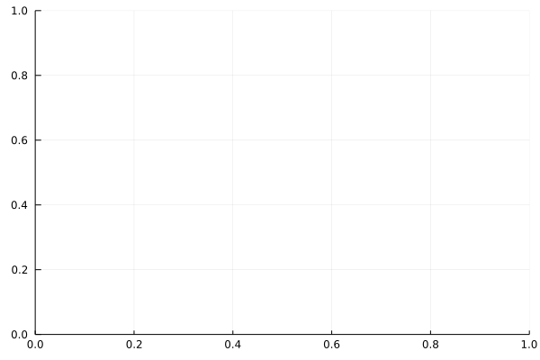
    


```julia
# make Data
# ignore print the data in notebook use ; at the end of command
x = 1:15;
y = rand(15);
```


```julia
plot(x,y)
```


    
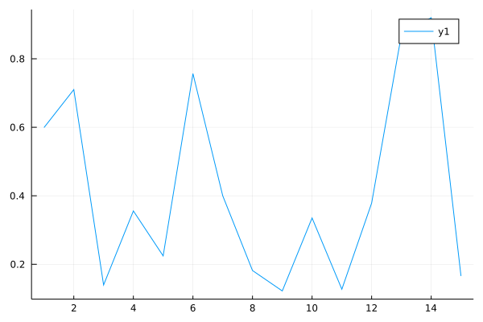
    


```julia
z = rand(15);
```


```julia
plot!(x,z) # add informaiton in past graph
```


    
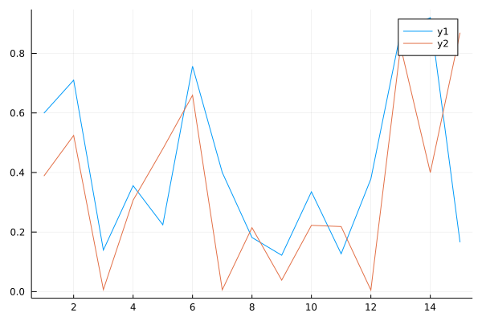
    


```julia
# alternative way to plot above graph

p = plot(x,y)
plot!(p,x,z)
```


    

    


```julia
# add title in the graph

plot(x,y,title="One Random Line Chart")
```


    
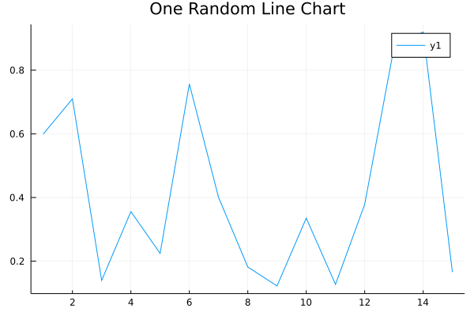
    


More Infromation About Plot() :- https://docs.juliaplots.org/latest/tutorial/


```julia
# adding label

plot(x, y , title="Random Line Chart" , label="Line 1" , lw = 2) # lw = linewidth
```


    
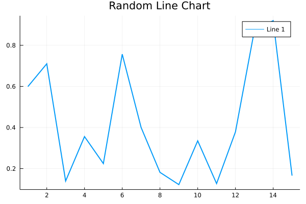
    


```julia
# x-axis label
# y-axis label

plot(x,y,title="Random Line Chart",label="Line 1",xlabel="X Axis",ylabel="Y Axis",lw = 2)
```


    
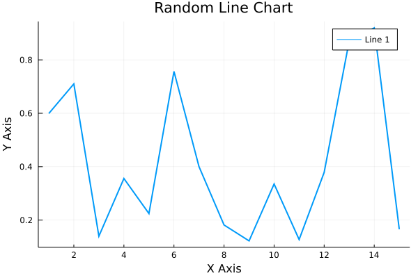
    


```julia
# scatter plot

scatter(1:50 , rand(50) ,markercolor="green",markersize = 6,title="Scatter plot",
    xlabel="X-Axis",ylabel="Y-Axis")
```


    
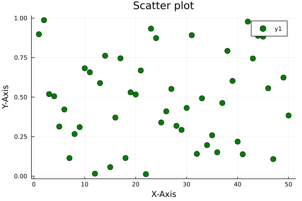
    


```julia
# bar plot

bar(x , y,title="Bar plot",xlabel="X-Axis",ylabel="Y-Axis",color="orange")
```


    
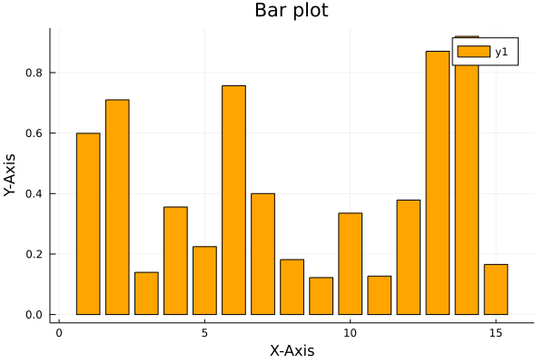
    


```julia
# histogram

histogram(y , title="Histogram Plot",xlabel="X-Axis",ylabel="Y-Axis")
```


    
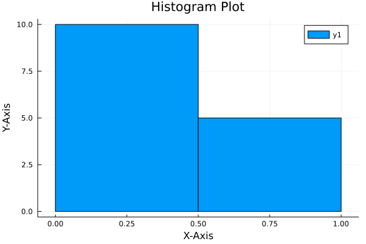
    


```julia
# combining all together

p1 = plot(x,y,color="green",lw = 2)
p2 = scatter(x,y,color="red")
p3 = bar(x,y , color = "yellow")
p4 = histogram(y , color="orange")

plot(p1,p2,p3,p4,layout = (2,2))
```


    
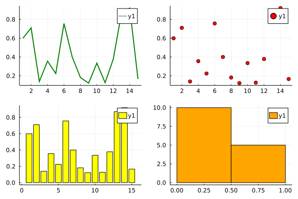
    


```julia
y = rand(15,4)
plot(x,y,layout =(4,1))
```


    
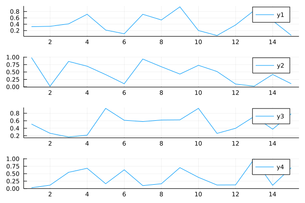
    


<h3 style="color:#890596">Data Visualization On Real Data</h3>


```julia
first(iris,5) # we are using iris dataset
```


<table class="data-frame"><thead><tr><th></th><th>Id</th><th>SepalLengthCm</th><th>SepalWidthCm</th><th>PetalLengthCm</th><th>PetalWidthCm</th><th>Species</th></tr><tr><th></th><th>Int64</th><th>Float64</th><th>Float64</th><th>Float64</th><th>Float64</th><th>String</th></tr></thead><tbody><p>5 rows × 6 columns</p><tr><th>1</th><td>1</td><td>5.1</td><td>3.5</td><td>1.4</td><td>0.2</td><td>Iris-setosa</td></tr><tr><th>2</th><td>2</td><td>4.9</td><td>3.0</td><td>1.4</td><td>0.2</td><td>Iris-setosa</td></tr><tr><th>3</th><td>3</td><td>4.7</td><td>3.2</td><td>1.3</td><td>0.2</td><td>Iris-setosa</td></tr><tr><th>4</th><td>4</td><td>4.6</td><td>3.1</td><td>1.5</td><td>0.2</td><td>Iris-setosa</td></tr><tr><th>5</th><td>5</td><td>5.0</td><td>3.6</td><td>1.4</td><td>0.2</td><td>Iris-setosa</td></tr></tbody></table>


```julia
plot(iris.PetalLengthCm)
```


    
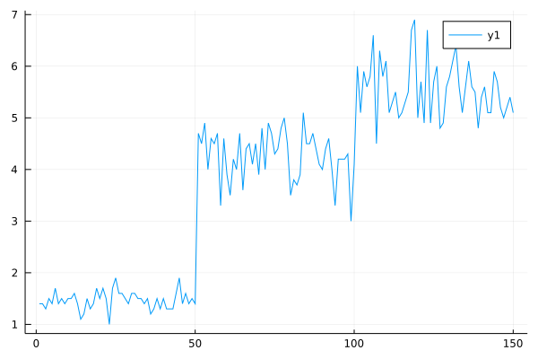
    


```julia
bar(iris.Species, iris.PetalLengthCm , color="orange")
```


    
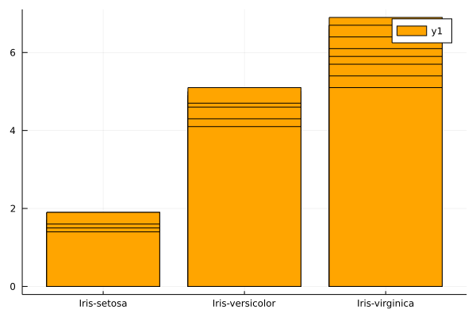
    


```julia
scatter(iris.PetalLengthCm , iris.PetalWidthCm , markercolor = "yellow")
```


    
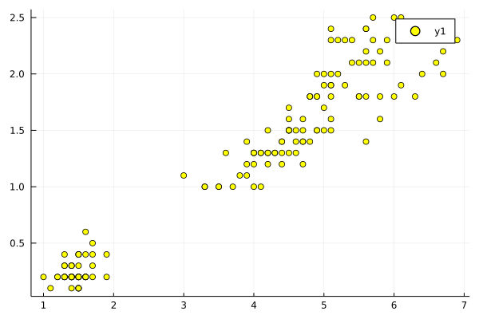
    


```julia
histogram(iris.PetalLengthCm)
```


    

    


<h2 style="color:#325288">Working With Database : SQL Lite</h2>


```julia
### downlaod package

# using Pkg
# Pkg.add("SQLite")
```


```julia
using SQLite
```

Operation with Database

* **DDL** : Create, Alter and Drop - *SQLite.DB*
* **DML** : Insert, Update and Delete - *SQLite.execute* 
* **DQL** : Select - *SQLite.Query*


```julia
# create the database
db = SQLite.DB("Movies")
```


    SQLite.DB("Movies")


```julia
SQLite.execute(db , "CREATE TABLE IF NOT EXISTS movies(movie_id REAL,movie_name TEXT,location TEXT)")
```


    101


```julia
# 101 means table create successfully...
```


```julia
SQLite.tables(db) # it shows how many tables present in the database.
```


    (name = ["movies"],)


```julia
# insert the record in table

SQLite.execute(db,"INSERT INTO movies(movie_id,movie_name,location) VALUES (1,'Avengers','USA')")
```


    101


```julia
# check wheather table has data or not 

using DataFrames
DataFrame(DBInterface.execute(db,"SELECT * FROM movies"))
```


<table class="data-frame"><thead><tr><th></th><th>movie_id</th><th>movie_name</th><th>location</th></tr><tr><th></th><th>Float64</th><th>String</th><th>String</th></tr></thead><tbody><p>2 rows × 3 columns</p><tr><th>1</th><td>1.0</td><td>Avengers</td><td>USA</td></tr><tr><th>2</th><td>1.0</td><td>Avengers</td><td>USA</td></tr></tbody></table>


```julia
# columns information of table

DataFrame(SQLite.columns(db,"movies")) 
```


<table class="data-frame"><thead><tr><th></th><th>cid</th><th>name</th><th>type</th><th>notnull</th><th>dflt_value</th><th>pk</th></tr><tr><th></th><th>Int64</th><th>String</th><th>String</th><th>Int64</th><th>Missing</th><th>Int64</th></tr></thead><tbody><p>3 rows × 6 columns</p><tr><th>1</th><td>0</td><td>movie_id</td><td>REAL</td><td>0</td><td><em>missing</em></td><td>0</td></tr><tr><th>2</th><td>1</td><td>movie_name</td><td>TEXT</td><td>0</td><td><em>missing</em></td><td>0</td></tr><tr><th>3</th><td>2</td><td>location</td><td>TEXT</td><td>0</td><td><em>missing</em></td><td>0</td></tr></tbody></table>


```julia
chinook = SQLite.DB("chinook.db")
```


    SQLite.DB("chinook.db")


```julia
print(SQLite.tables(chinook))
```

    (name = ["albums", "sqlite_sequence", "artists", "customers", "employees", "genres", "invoices", "invoice_items", "media_types", "playlists", "playlist_track", "tracks", "sqlite_stat1"],)


```julia
DataFrame(DBInterface.execute(chinook,"SELECT * FROM employees"))
```


<table class="data-frame"><thead><tr><th></th><th>EmployeeId</th><th>LastName</th><th>FirstName</th><th>Title</th><th>ReportsTo</th><th>BirthDate</th></tr><tr><th></th><th>Int64</th><th>String</th><th>String</th><th>String</th><th>Int64?</th><th>String</th></tr></thead><tbody><p>8 rows × 15 columns (omitted printing of 9 columns)</p><tr><th>1</th><td>1</td><td>Adams</td><td>Andrew</td><td>General Manager</td><td><em>missing</em></td><td>1962-02-18 00:00:00</td></tr><tr><th>2</th><td>2</td><td>Edwards</td><td>Nancy</td><td>Sales Manager</td><td>1</td><td>1958-12-08 00:00:00</td></tr><tr><th>3</th><td>3</td><td>Peacock</td><td>Jane</td><td>Sales Support Agent</td><td>2</td><td>1973-08-29 00:00:00</td></tr><tr><th>4</th><td>4</td><td>Park</td><td>Margaret</td><td>Sales Support Agent</td><td>2</td><td>1947-09-19 00:00:00</td></tr><tr><th>5</th><td>5</td><td>Johnson</td><td>Steve</td><td>Sales Support Agent</td><td>2</td><td>1965-03-03 00:00:00</td></tr><tr><th>6</th><td>6</td><td>Mitchell</td><td>Michael</td><td>IT Manager</td><td>1</td><td>1973-07-01 00:00:00</td></tr><tr><th>7</th><td>7</td><td>King</td><td>Robert</td><td>IT Staff</td><td>6</td><td>1970-05-29 00:00:00</td></tr><tr><th>8</th><td>8</td><td>Callahan</td><td>Laura</td><td>IT Staff</td><td>6</td><td>1968-01-09 00:00:00</td></tr></tbody></table>


**Important Topics** *(You Have to Do It By Yourself)*
* Where Condition
* Group By
* Order By
* Having
* Join

<h3 style="color:#325288">Refrence Links :</h3>

* SQL Lite : https://www.sqlitetutorial.net/
* SQLite Package in Julia : https://juliadatabases.org/SQLite.jl/stable/ 

<h2 style="color:#81b214">Working With Python Package</h2>


```julia
# download package PyCall

# using Pkg
# Pkg.add("PyCall")
```


```julia
using PyCall
```


```julia
np = pyimport("numpy")
```


    PyObject <module 'numpy' from 'C:\\Users\\Admin\\.julia\\conda\\3\\lib\\site-packages\\numpy\\__init__.py'>


```julia
a1 = np.array([2,3,4,5,6])
```


    5-element Vector{Int64}:
     2
     3
     4
     5
     6


```julia
println(np.mean(a1))
println(np.std(a1))
```

    4.0
    1.4142135623730951
    

<b style="color:#f7a440">FOR MORE CHECKOUT GEEKS FOR GEEKS BLOG :</b><br>
<a href="https://www.geeksforgeeks.org/how-to-import-python-packages-in-julia/#:~:text=Users%20can%20import%20arbitrary%20Python,the%20Julia%20environment%20with%20Pkg."><b>Working with Python Package in Julia</b></a>

<h1 style="color:#184d47">Machine Learning In Julia</h1>


```julia
### add ML packages
### add CSV,DataFrames package if you don't have installed this package run below command

# # scikit learn
# using Pkg
# Pkg.add("ScikitLearn")

# # CSV
# using Pkg
# Pkg.add("CSV")

### DataFrames
# using Pkg
# Pkg.add("DataFrames")
```


```julia
using ScikitLearn , CSV
```

    ┌ Info: Precompiling ScikitLearn [3646fa90-6ef7-5e7e-9f22-8aca16db6324]
    └ @ Base loading.jl:1317
    ┌ Warning: Module StatsBase with build ID 115569723039701 is missing from the cache.
    │ This may mean StatsBase [2913bbd2-ae8a-5f71-8c99-4fb6c76f3a91] does not support precompilation but is imported by a module that does.
    └ @ Base loading.jl:1008
    ┌ Info: Skipping precompilation since __precompile__(false). Importing ScikitLearn [3646fa90-6ef7-5e7e-9f22-8aca16db6324].
    └ @ Base loading.jl:1025
    


```julia
using DataFrames
```


```julia
iris = CSV.read("Iris.csv",DataFrame)
```


<table class="data-frame"><thead><tr><th></th><th>Id</th><th>SepalLengthCm</th><th>SepalWidthCm</th><th>PetalLengthCm</th><th>PetalWidthCm</th><th>Species</th></tr><tr><th></th><th>Int64</th><th>Float64</th><th>Float64</th><th>Float64</th><th>Float64</th><th>String</th></tr></thead><tbody><p>150 rows × 6 columns</p><tr><th>1</th><td>1</td><td>5.1</td><td>3.5</td><td>1.4</td><td>0.2</td><td>Iris-setosa</td></tr><tr><th>2</th><td>2</td><td>4.9</td><td>3.0</td><td>1.4</td><td>0.2</td><td>Iris-setosa</td></tr><tr><th>3</th><td>3</td><td>4.7</td><td>3.2</td><td>1.3</td><td>0.2</td><td>Iris-setosa</td></tr><tr><th>4</th><td>4</td><td>4.6</td><td>3.1</td><td>1.5</td><td>0.2</td><td>Iris-setosa</td></tr><tr><th>5</th><td>5</td><td>5.0</td><td>3.6</td><td>1.4</td><td>0.2</td><td>Iris-setosa</td></tr><tr><th>6</th><td>6</td><td>5.4</td><td>3.9</td><td>1.7</td><td>0.4</td><td>Iris-setosa</td></tr><tr><th>7</th><td>7</td><td>4.6</td><td>3.4</td><td>1.4</td><td>0.3</td><td>Iris-setosa</td></tr><tr><th>8</th><td>8</td><td>5.0</td><td>3.4</td><td>1.5</td><td>0.2</td><td>Iris-setosa</td></tr><tr><th>9</th><td>9</td><td>4.4</td><td>2.9</td><td>1.4</td><td>0.2</td><td>Iris-setosa</td></tr><tr><th>10</th><td>10</td><td>4.9</td><td>3.1</td><td>1.5</td><td>0.1</td><td>Iris-setosa</td></tr><tr><th>11</th><td>11</td><td>5.4</td><td>3.7</td><td>1.5</td><td>0.2</td><td>Iris-setosa</td></tr><tr><th>12</th><td>12</td><td>4.8</td><td>3.4</td><td>1.6</td><td>0.2</td><td>Iris-setosa</td></tr><tr><th>13</th><td>13</td><td>4.8</td><td>3.0</td><td>1.4</td><td>0.1</td><td>Iris-setosa</td></tr><tr><th>14</th><td>14</td><td>4.3</td><td>3.0</td><td>1.1</td><td>0.1</td><td>Iris-setosa</td></tr><tr><th>15</th><td>15</td><td>5.8</td><td>4.0</td><td>1.2</td><td>0.2</td><td>Iris-setosa</td></tr><tr><th>16</th><td>16</td><td>5.7</td><td>4.4</td><td>1.5</td><td>0.4</td><td>Iris-setosa</td></tr><tr><th>17</th><td>17</td><td>5.4</td><td>3.9</td><td>1.3</td><td>0.4</td><td>Iris-setosa</td></tr><tr><th>18</th><td>18</td><td>5.1</td><td>3.5</td><td>1.4</td><td>0.3</td><td>Iris-setosa</td></tr><tr><th>19</th><td>19</td><td>5.7</td><td>3.8</td><td>1.7</td><td>0.3</td><td>Iris-setosa</td></tr><tr><th>20</th><td>20</td><td>5.1</td><td>3.8</td><td>1.5</td><td>0.3</td><td>Iris-setosa</td></tr><tr><th>21</th><td>21</td><td>5.4</td><td>3.4</td><td>1.7</td><td>0.2</td><td>Iris-setosa</td></tr><tr><th>22</th><td>22</td><td>5.1</td><td>3.7</td><td>1.5</td><td>0.4</td><td>Iris-setosa</td></tr><tr><th>23</th><td>23</td><td>4.6</td><td>3.6</td><td>1.0</td><td>0.2</td><td>Iris-setosa</td></tr><tr><th>24</th><td>24</td><td>5.1</td><td>3.3</td><td>1.7</td><td>0.5</td><td>Iris-setosa</td></tr><tr><th>25</th><td>25</td><td>4.8</td><td>3.4</td><td>1.9</td><td>0.2</td><td>Iris-setosa</td></tr><tr><th>26</th><td>26</td><td>5.0</td><td>3.0</td><td>1.6</td><td>0.2</td><td>Iris-setosa</td></tr><tr><th>27</th><td>27</td><td>5.0</td><td>3.4</td><td>1.6</td><td>0.4</td><td>Iris-setosa</td></tr><tr><th>28</th><td>28</td><td>5.2</td><td>3.5</td><td>1.5</td><td>0.2</td><td>Iris-setosa</td></tr><tr><th>29</th><td>29</td><td>5.2</td><td>3.4</td><td>1.4</td><td>0.2</td><td>Iris-setosa</td></tr><tr><th>30</th><td>30</td><td>4.7</td><td>3.2</td><td>1.6</td><td>0.2</td><td>Iris-setosa</td></tr><tr><th>&vellip;</th><td>&vellip;</td><td>&vellip;</td><td>&vellip;</td><td>&vellip;</td><td>&vellip;</td><td>&vellip;</td></tr></tbody></table>


```julia
features = iris[:,[2,3,4,5]];
```


```julia
target = iris.Species;
```


```julia
features = Matrix(features)
```


    150×4 Matrix{Float64}:
     5.1  3.5  1.4  0.2
     4.9  3.0  1.4  0.2
     4.7  3.2  1.3  0.2
     4.6  3.1  1.5  0.2
     5.0  3.6  1.4  0.2
     5.4  3.9  1.7  0.4
     4.6  3.4  1.4  0.3
     5.0  3.4  1.5  0.2
     4.4  2.9  1.4  0.2
     4.9  3.1  1.5  0.1
     5.4  3.7  1.5  0.2
     4.8  3.4  1.6  0.2
     4.8  3.0  1.4  0.1
     ⋮              
     6.0  3.0  4.8  1.8
     6.9  3.1  5.4  2.1
     6.7  3.1  5.6  2.4
     6.9  3.1  5.1  2.3
     5.8  2.7  5.1  1.9
     6.8  3.2  5.9  2.3
     6.7  3.3  5.7  2.5
     6.7  3.0  5.2  2.3
     6.3  2.5  5.0  1.9
     6.5  3.0  5.2  2.0
     6.2  3.4  5.4  2.3
     5.9  3.0  5.1  1.8


```julia
target = convert(Array,target)
```


    150-element Vector{String}:
     "Iris-setosa"
     "Iris-setosa"
     "Iris-setosa"
     "Iris-setosa"
     "Iris-setosa"
     "Iris-setosa"
     "Iris-setosa"
     "Iris-setosa"
     "Iris-setosa"
     "Iris-setosa"
     "Iris-setosa"
     "Iris-setosa"
     "Iris-setosa"
     ⋮
     "Iris-virginica"
     "Iris-virginica"
     "Iris-virginica"
     "Iris-virginica"
     "Iris-virginica"
     "Iris-virginica"
     "Iris-virginica"
     "Iris-virginica"
     "Iris-virginica"
     "Iris-virginica"
     "Iris-virginica"
     "Iris-virginica"


<h3 style="color:red">Logistic Regression</h3>


```julia
@sk_import linear_model: LogisticRegression
```


    PyObject <class 'sklearn.linear_model._logistic.LogisticRegression'>


```julia
log_reg_model = LogisticRegression()
```


    PyObject LogisticRegression()


```julia
fit!(log_reg_model,features,target)
```


    PyObject LogisticRegression()


```julia
predictions = predict(log_reg_model,features);
```


```julia
@sk_import metrics:accuracy_score
```


    PyObject <function accuracy_score at 0x0000000099E010D0>


```julia
accuracy_score(predictions , target)
```


    0.9733333333333334


<h3 style="color:red">Decision Tree</h3>


```julia
@sk_import tree:DecisionTreeClassifier
```


    PyObject <class 'sklearn.tree._classes.DecisionTreeClassifier'>


```julia
tree_model = DecisionTreeClassifier()
```


    PyObject DecisionTreeClassifier()


```julia
fit!(tree_model,features,target)
```


    PyObject DecisionTreeClassifier()


```julia
predictions = predict(tree_model,features);
```


```julia
accuracy_score(predictions , target) 
```


    1.0


<h3 style="color:red">Random Forest</h3>


```julia
@sk_import ensemble: RandomForestClassifier
```


    PyObject <class 'sklearn.ensemble._forest.RandomForestClassifier'>


```julia
random_forest = RandomForestClassifier(n_estimators = 5)
```


    PyObject RandomForestClassifier(n_estimators=5)


```julia
fit!(random_forest , features , target)
```


    PyObject RandomForestClassifier(n_estimators=5)


```julia
predictions = predict(random_forest , features);
```


```julia
accuracy_score(predictions , target)
```


    0.9866666666666667


<h3 style="color:red">Train Test Split</h3>


```julia
@sk_import model_selection : train_test_split
```

    ┌ Warning: Module model_selection has been ported to Julia - try `import ScikitLearn: CrossValidation` instead
    └ @ ScikitLearn.Skcore C:\Users\Admin\.julia\packages\ScikitLearn\NJwUf\src\Skcore.jl:179
    


    PyObject <function train_test_split at 0x0000000099DD7280>


```julia
x_train , x_test , y_train , y_test = train_test_split(features , target , test_size = 0.2 , random_state = 0);
```


```julia
log_reg_2 = LogisticRegression(solver="lbfgs", max_iter=1000)

# add hyperparameters to ignore the warning.
```


    PyObject LogisticRegression(max_iter=1000)


```julia
fit!(log_reg_2,x_train,y_train)
```


    PyObject LogisticRegression(max_iter=1000)


```julia
preditions = predict(log_reg_2 , x_test);
```


```julia
accuracy_score(preditions , y_test)
```


    1.0


<h1 style="color:#3282b8;font-size:32px" align='center'>THANK YOU 🎉🎊</h1>

<b>For More Details Do Check Out Julia Official Documentation.</b><br>
https://docs.julialang.org/en/v1/
